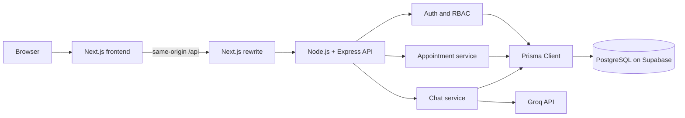

# Consult — AI-Assisted Appointment Booking

**Author:** Mustehsan Ali  
**Live demo:** https://assessment.dovixatech.com/  
**Repository:** https://github.com/mustehsanCodes/ai-assisted-appointment-booking

Consult is a full-stack appointment-booking prototype. An authenticated user can ask the booking assistant for a suitable consultation time, use the manual booking form, review a request, and track the resulting appointment. Administrators can review pending booking requests and manage the appointment workflow.

## Features

- User signup and login with JWT authentication in an HttpOnly cookie
- Role-based access for regular users and administrators
- Protected chat and appointment routes with ownership checks
- Multi-turn appointment conversation with a persisted booking draft
- Groq-powered extraction of appointment date, time, and intent
- Manual booking fallback when AI is unavailable or input is incomplete
- Server-generated available slots and explicit booking confirmation
- Admin approval workflow for pending appointment requests
- Responsive interface with loading, empty, success, and error states

## Architecture



The browser communicates with the Next.js origin. Next.js rewrites `/api/*` requests to Express. Express owns authentication, authorization, validation, booking rules, AI coordination, and database access. The browser never receives the database URL or Groq API key.

### Technology choices

| Technology | Purpose |
|---|---|
| Next.js App Router | Frontend routing, layouts, and React UI |
| Node.js and Express | REST API and backend application services |
| PostgreSQL | Relational persistence and database constraints |
| Supabase | Managed PostgreSQL hosting |
| Prisma | Typed database access and migrations |
| Groq | Natural-language appointment extraction |
| TanStack Query | Server-state fetching, caching, polling, and invalidation |
| Zod | Request, environment, and AI-output validation |
| Pino | Structured application logging |

The backend is a modular monolith. Authentication, appointments, chat, and AI are separate feature modules in one deployable Express application. This keeps service boundaries clear while keeping the assessment easy to run and deploy.

## Core workflow

1. A user creates an account or signs in.
2. The user opens the booking assistant or selects a date manually.
3. The assistant extracts candidate booking details and asks for missing information.
4. The user reviews the service, date, time, and timezone.
5. The frontend sends an explicit confirmation request with an idempotency key.
6. Express validates ownership, business hours, slot alignment, horizon, and availability.
7. PostgreSQL enforces uniqueness during concurrent requests.
8. The user sees the persisted appointment. Pending requests are available for administrator review.

The AI service only interprets natural language. It does not write appointments, execute SQL, decide availability, or claim that a booking is confirmed. Confirmation is generated from persisted appointment data.

## Roles and authorization

| Role | Permissions |
|---|---|
| `USER` | Create chat sessions, request appointments, and view their own records |
| `ADMIN` | Review pending requests, manage appointment status, and view administrative scheduling data |

The backend enforces both role permissions and resource ownership. Hiding an admin link in the frontend is only a UX convenience; the API independently returns `403` for unauthorized role access. A user cannot read another user's appointment by changing an ID in the URL.

## Scheduling assumptions

- One consultation service and one bookable resource
- Appointment duration: 30 minutes
- Timezone: `Asia/Karachi`
- Working days: Monday through Friday
- Working hours: 09:00–17:00
- Booking horizon: 30 days
- One confirmed appointment per slot
- Cancellation and rescheduling are outside this prototype's scope

## Repository structure

```text
apps/
  web/                 Next.js frontend
  api/                 Express backend and Prisma schema
packages/contracts/    Public shared TypeScript contracts
database/              SQL DDL and sample data
docs/                  Architecture, API, decisions, and deployment
scripts/               Project utility scripts
compose.yaml           Local PostgreSQL service
```

Feature code is grouped by responsibility. Express routes define endpoints, middleware handles cross-cutting concerns, controllers translate HTTP requests, services execute application workflows, and infrastructure adapters communicate with Prisma and Groq.

## Run locally

### Prerequisites

- Node.js 24 or later
- pnpm 10 or later
- Docker or a PostgreSQL database
- A Supabase PostgreSQL project for hosted development, if preferred

### Install and configure

```bash
corepack enable
pnpm install
cp apps/api/.env.example apps/api/.env
cp apps/web/.env.example apps/web/.env.local
```

Set real values in `apps/api/.env` and keep it untracked:

```env
NODE_ENV=development
PORT=4000
DATABASE_URL=postgresql://...
DIRECT_URL=postgresql://...
JWT_SECRET=replace-with-a-long-random-secret
JWT_EXPIRES_IN=2h
ALLOWED_ORIGINS=http://localhost:3000
GROQ_API_KEY=
GROQ_MODEL=
AI_TIMEOUT_MS=15000
BUSINESS_TIMEZONE=Asia/Karachi
```

```bash
pnpm --filter @appointment/api prisma generate
pnpm db:migrate
pnpm db:seed
pnpm dev
```

The frontend runs at `http://localhost:3000`; the API runs at `http://localhost:4000`. Without `GROQ_API_KEY`, the manual booking flow remains available and the UI indicates that AI assistance is unavailable.

## Demo accounts

| Role | Email | Password | Landing page |
|---|---|---|---|
| User | `demo@example.com` | `DemoPassword123!` | `/dashboard` |
| Administrator | `admin@example.com` | `DemoPassword123!` | `/admin` |

These are demonstration credentials only.

## API overview

| Method | Endpoint | Auth | Purpose |
|---|---|---:|---|
| POST | `/api/auth/signup` | No | Create an account |
| POST | `/api/auth/login` | No | Authenticate and set cookie |
| POST | `/api/auth/logout` | No | Clear authentication cookie |
| GET | `/api/auth/me` | Yes | Return current user |
| GET | `/api/appointments/availability` | Yes | Return server-generated slots |
| POST | `/api/appointments` | Yes | Create or replay a booking request |
| GET | `/api/appointments` | Yes | List the current user's appointments |
| GET | `/api/appointments/:id` | Yes | Read an owned appointment |
| POST | `/api/chat/sessions` | Yes | Create a chat session |
| GET | `/api/chat/sessions/:id/messages` | Yes | Read session messages |
| POST | `/api/chat/sessions/:id/messages` | Yes | Send a chat message |
| GET | `/api/health` | No | Process health |
| GET | `/api/health/ready` | No | Database readiness |

Errors contain an application code, safe message, optional field errors, and request ID. Slot conflicts return `409`; invalid input `400`; unauthenticated requests `401`; unauthorized roles `403`.

## Data model

The PostgreSQL schema contains `users`, `appointments`, `chat_sessions`, and `chat_messages`. Foreign keys protect relationships. Email and idempotency keys are unique. Appointment timestamps and ownership are indexed. A database uniqueness rule protects the single-resource slot from concurrent double booking. SQL reference files are under `database/`; Prisma migrations are under `apps/api/prisma/migrations/`.

## Security and reliability decisions

- Passwords are hashed and never returned.
- JWTs use HttpOnly cookies rather than local storage.
- Express enforces authentication, roles, and ownership.
- Request bodies, query parameters, and AI output are validated.
- API keys and database credentials remain server-side.
- Helmet, rate limiting, request IDs, and structured logs are enabled.
- Logs redact cookies, authorization headers, passwords, tokens, keys, and database URLs.
- Idempotency protects retries from duplicate appointments.
- PostgreSQL constraints remain the final authority under concurrent requests.
- The AI provider is isolated behind an application service and can be replaced without changing booking rules.

## Verification

```bash
pnpm typecheck
pnpm lint
pnpm test
pnpm build
```

The AI provider should be mocked in automated tests. Database concurrency and constraint behavior should be verified against disposable PostgreSQL.

## Tradeoffs and limitations

This is an assessment-sized prototype with one resource, fixed duration, and bounded synchronous AI processing. A larger system could add durable queues, distributed rate limiting, multiple providers, cancellation/rescheduling, resource-specific availability, refresh-token rotation, audit events, and broader end-to-end coverage. Free hosting can introduce cold-start delays and is not a production SLA.

## Documentation

- [Architecture](docs/architecture.md)
- [API reference](docs/api.md)
- [Design decisions](docs/decisions.md)
- [Deployment](docs/deployment.md)
- [Demo checklist](docs/demo-checklist.md)

## Author

Mustehsan Ali
